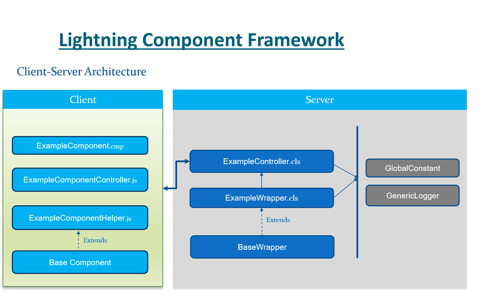

# LightningComponentGenericFramework
A generic lightning component development framework utilizing BaseLightningComponent for reusability and client-server communication with wrapper based Js normalized stream.

Deploy option - 
**Deploy to SFDX Scratch Org:**

**Deploy to Salesforce Org:**

